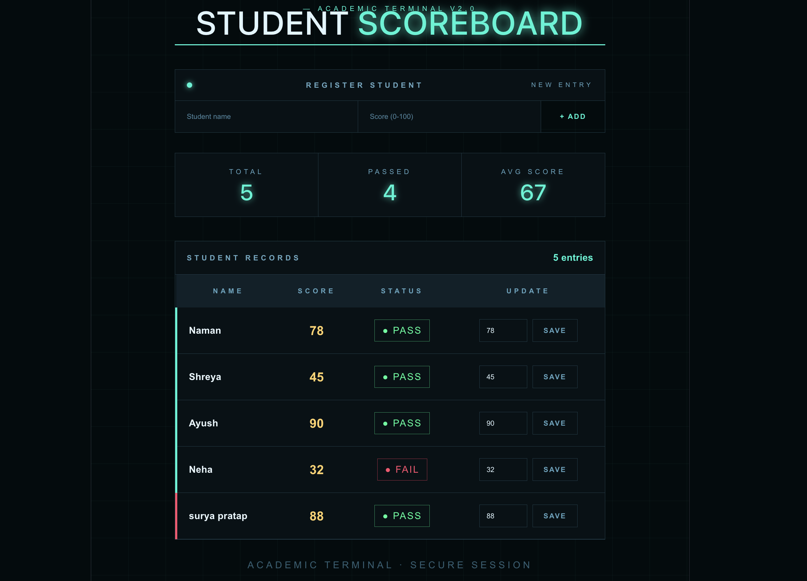

# 🎓 Student Scoreboard

A modern **Student Scoreboard** built using **React.js** that helps manage student records, track scores, calculate statistics, and update academic performance in real time.

This project demonstrates React fundamentals including state management, dynamic rendering, conditional styling, and CRUD operations.

---

## 📸 Preview

<p align="center">
  
</p>


---

## ✨ Features

- 👨‍🎓 Register New Students
- 📝 Add Student Scores
- 📊 Real-Time Statistics
- ✅ Automatic Pass/Fail Status
- 📈 Average Score Calculation
- 🔄 Update Student Scores
- ⚡ Dynamic UI Updates
- 📱 Responsive Design

---

## 🛠️ Tech Stack

- React.js
- JavaScript (ES6+)
- HTML5
- CSS3

---

## 📂 Project Structure

```
Student-Scoreboard/
│
├── public/
├── src/
├── screenshot.png
├── package.json
├── README.md
└── vite.config.js
```

---

## 🚀 Live Demo

🌐 Live Website

student-scoreboard-reac.netlify.app

---

## ⚙️ Installation

Clone the repository

```bash
git clone https://github.com/suryaraghav2703-spec/student-scoreboard-react
```

Go to the project folder

```bash
cd student-scoreboard-react
```

Install dependencies

```bash
npm install
```

Run the application

```bash
npm run dev
```

---

## 📚 What I Learned

- React Functional Components
- useState Hook
- Props
- Dynamic Rendering
- Conditional Rendering
- Array Mapping
- CRUD Operations
- Event Handling
- State Management

---

## 🎯 Future Improvements

- 🔍 Search Students
- 📂 Filter by Pass/Fail
- 🗑️ Delete Student Records
- 💾 Save Data using Local Storage
- 📥 Export Results as CSV
- 🌙 Dark/Light Theme

---


## ⭐ Support

If you found this project useful, consider giving it a ⭐ on GitHub.

Feedback and suggestions are always welcome!
